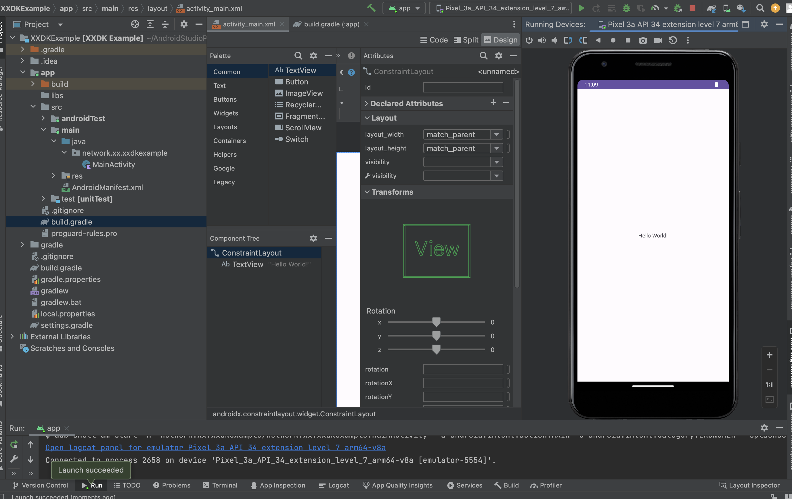
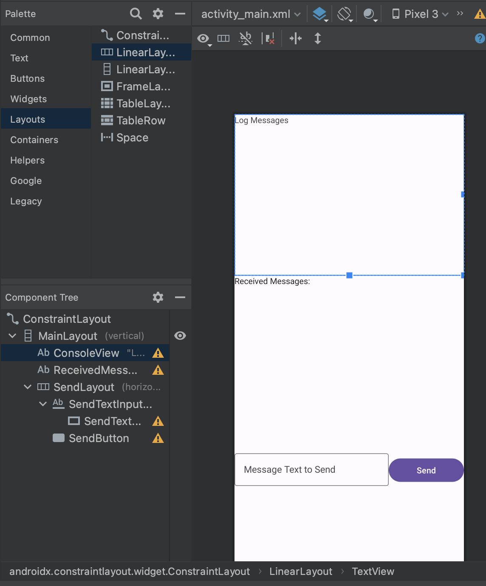
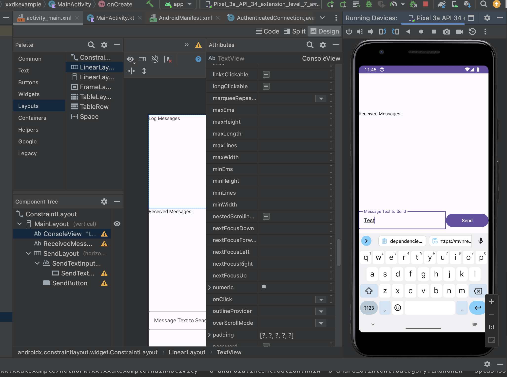
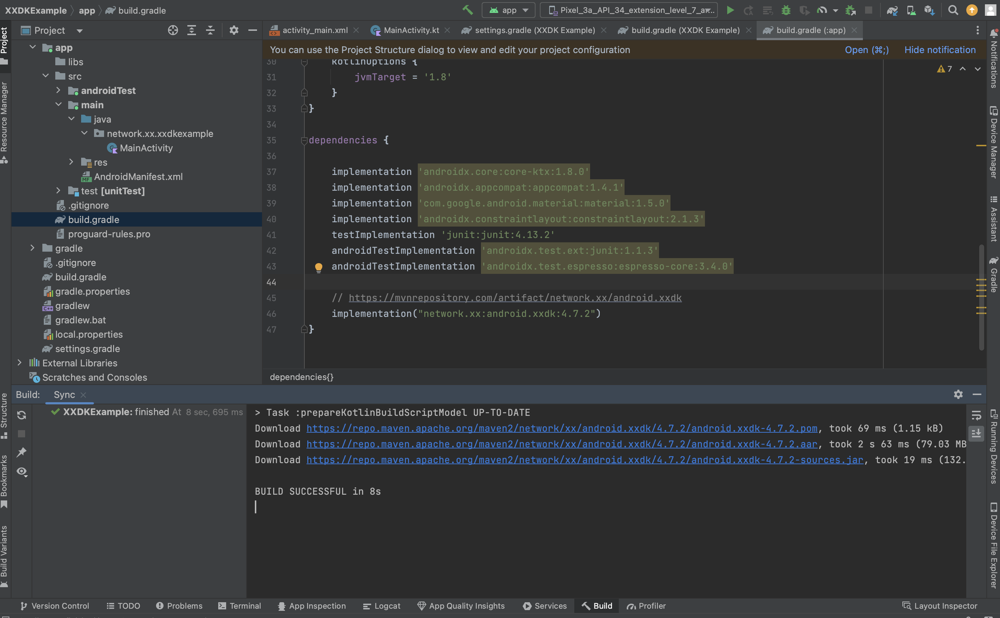
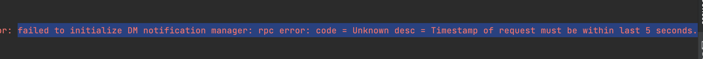
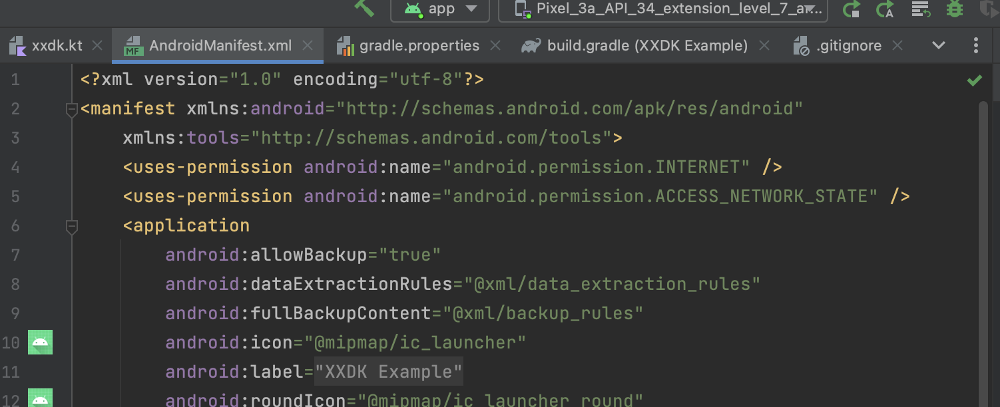

# android

An xxdk example written for Android.

## Running This Example

You will need Android Studio:

https://developer.android.com/studio/install

You will then need to ensure you have a simulator for at least API 34
available for the project to run. We used `Pixel_3_API_34` in ours.

## How This Example Was Built

We started with a blank project then built a visual template:





Then we added our dependencies to the `app/build.gradle` file:

```
...
dependencies {

    implementation 'androidx.core:core-ktx:1.8.0'
    implementation 'androidx.appcompat:appcompat:1.4.1'
    implementation 'com.google.android.material:material:1.5.0'
    implementation 'androidx.constraintlayout:constraintlayout:2.1.3'
    testImplementation 'junit:junit:4.13.2'
    androidTestImplementation 'androidx.test.ext:junit:1.1.3'
    androidTestImplementation 'androidx.test.espresso:espresso-core:3.4.0'

    // https://mvnrepository.com/artifact/network.xx/android.xxdk
    implementation "network.xx:android.xxdk:4.7.2"
    implementation "com.lyft.kronos:kronos-android:0.0.1-alpha11"

    implementation "androidx.lifecycle:lifecycle-viewmodel-ktx:2.7.0"
    implementation "androidx.lifecycle:lifecycle-livedata-ktx:2.7.0"
    implementation "androidx.fragment:fragment-ktx:1.6.2"
    implementation "androidx.activity:activity-ktx:1.8.2"
}
...
```




Specifically, we need "Kronos" for timekeeping in addition to the
xxdk. You can see the details for the XXDK package here:

https://mvnrepository.com/artifact/network.xx/android.xxdk

Without Kronos we can get time sync issues like this:




After this, gradle will download the artifacts and you will be
able to work with the xxdk bindings with `import bindings...`. See
`xxdk.kt` for the bulk of how these examples are used.

Before we connect to the network, we need to set the `INTERNET` and
`ACCESS_NETWORK_STATE` permissions:



To set up the xx network connection, we put our `mainnet.crt`
certificate file inside `res/raw`. This allowed us to call the
download NDF function and complete the connection.
