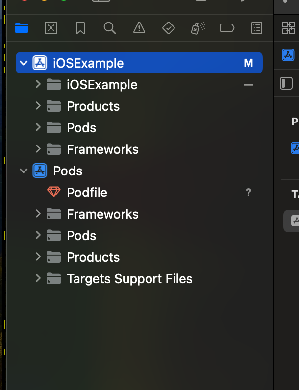
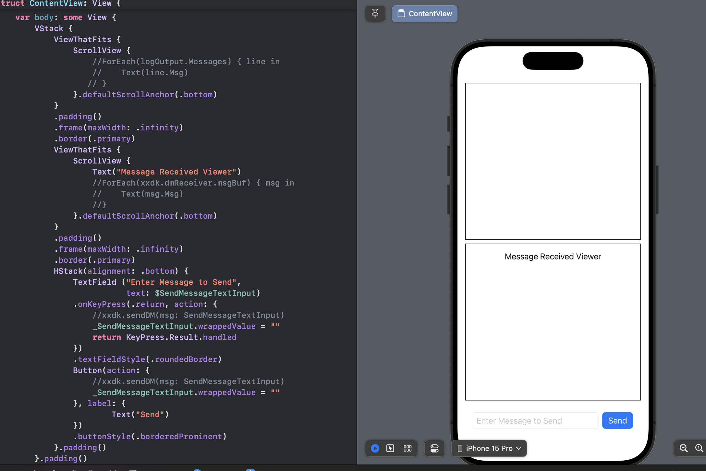
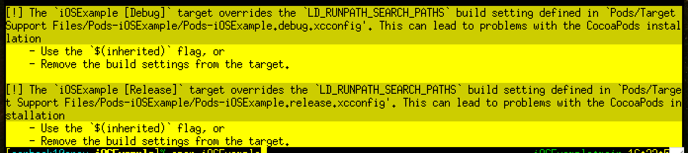
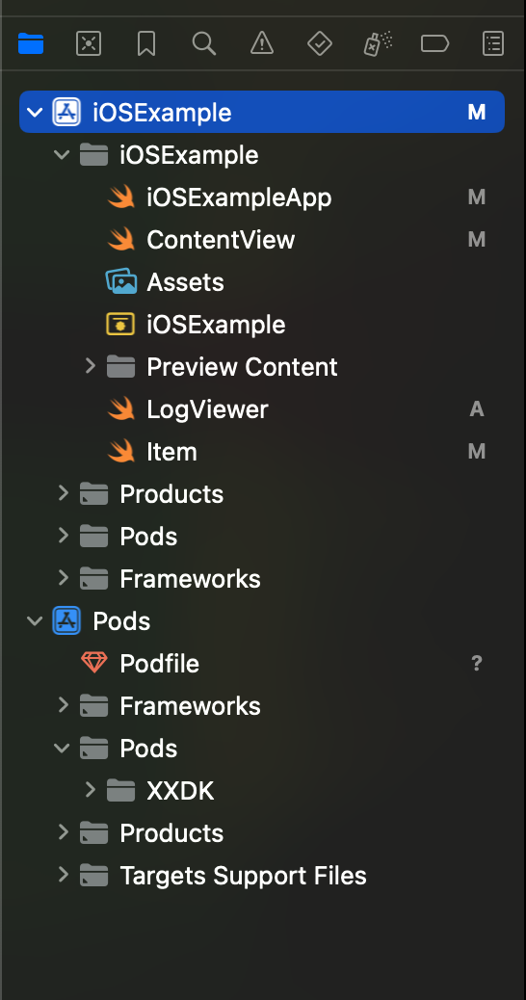
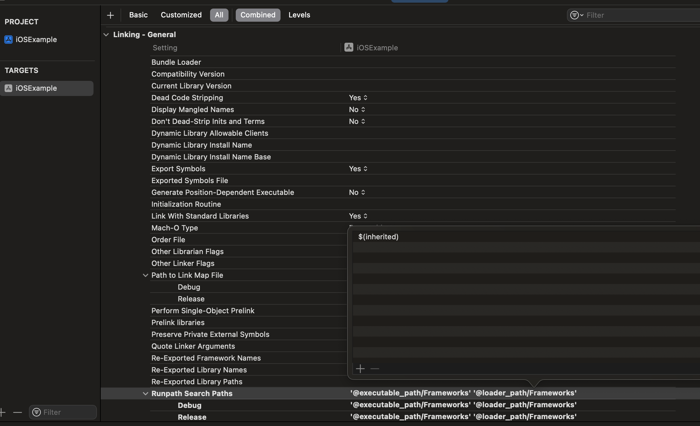
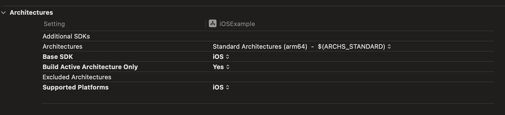

# iOS

An xxdk example written for iOS.

## Running This Example

You will need a mac and XCode 15 or higher:

https://developer.apple.com/xcode/resources/

You will then need to ensure you have a simulator for at least iOS 17
available for the project to run. XCode will prompt you and we recommend
using its suggested defaults.

You will need to install Cocoapods, assuming you have the default Ruby
install, you can install it in the Terminal with:

```
sudo gem install cocoapods
```

After it is installed, you can run the following in the Terminal to download
the dependencies to the `Pods` folder:

```
pod update
```

Now open the project with:

```
open iOSExample.xcworkspace
```

And you should see the following in the file browser:




## How This Example Was Built

We started with a blank project then built a visual template using
the SwiftUI visual editor:



After getting the basic widgets in place, we closed XCode. Then we added 
the following to a new file called `Podfile`:

```
# xxdk is built for this version of iOS or higher.
platform :ios, '17.0'

# This is required for swift since it does not support static libraries.
use_frameworks!

target 'iOSExample' do
  pod 'XXDK'
  pod 'Kronos'
end
```

We need Kronos for time tracking and XXDK to work with the xx
network. Then we ran the following to download our pods to the `Pods`
folder:

```
pod install
```

When it completed we were warned about `$(inherited)`:



and we were warned to open the project a specific way:


We opened the project again accordingly with:

```
open iOSExample.xcworkspace
```

Yielding the following files in the file browser:




Then we fixed the `$(inherited)` setting by opening our `TARGETS` target, 
finding `Runpath Search Paths` and changing it accordingly:



We also went through the build settings and made sure we were only
building for and targeting iOS:



Technically the library does support macos, but we have not tested
it. If you get it working please let us know and/or send a pull
request to update this project.

To set up the xx network connection, we put our `mainnet.crt`
certificate file inside the `Resources` folder. This allowed us to
call the download NDF function and complete the connection using the
standard methods.

All the other details can be found in XXDK.swift, with the
ContentView.swift hooked appropriately. One note is that the xxdk must
be controlled by the main thread. There is no handling in the example
but when the app sleeps and awakes it should stop and start the
network follower.
